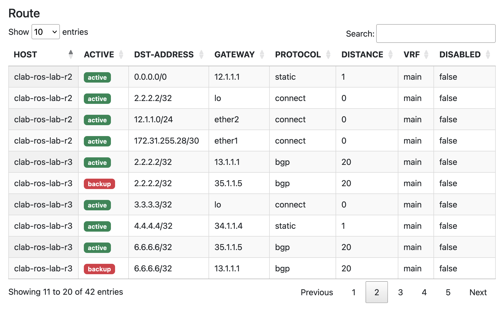
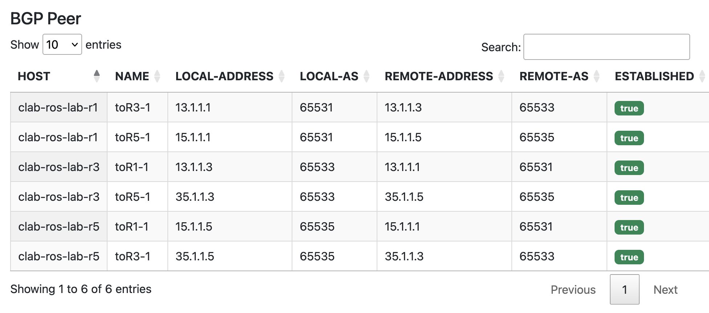

# MikroTik Network Automation Dashboard

A network automation tool built with Django and Nornir for managing MikroTik devices and retrieving network information.

The project separates **persistent device information** from **real-time network state**.

## Features

### Device Management

* Manage MikroTik devices through the Django Admin interface
* Use custom Django Admin Actions to batch collect device information
* Store the following information in the database:

  * RouterOS version
  * CPU information
  * Hardware model
  * Serial number

### Real-time Network Information

* Retrieve routing tables from multiple MikroTik devices in real time
* Retrieve BGP neighbor information in real time
* Display routing and BGP information through searchable and sortable tables
* Real-time routing and BGP data is **not stored in the database**

## Tech Stack

* **Python**
* **Django**
* **Nornir**
* **nornir-routeros**
* **MikroTik RouterOS**
* **Bootstrap** — UI styling
* **DataTables** — table display and interaction
* **SQLite** — persistent device information

## Installation

Clone the repository:

```bash
git clone https://github.com/sylar-netops/mikrotik-network-automation.git
cd mikrotik-network-automation
```

Create a virtual environment:

```bash
python3 -m venv venv
source venv/bin/activate
```

Install dependencies:

```bash
pip install -r requirements.txt
```

### Configure Environment Variables

Create a `.env` file in the project root:

```env
SECRET_KEY=your-django-secret-key
MT_USER=your-mikrotik-username
MT_PASS=your-mikrotik-password
```

Apply database migrations:

```bash
python manage.py makemigrations
python manage.py migrate
```

Create an administrator account:

```bash
python manage.py createsuperuser
```

Start the development server:

```bash
python manage.py runserver
```

Open:

```text
http://127.0.0.1:8000/
```

## Usage

1. Log in to the Django administration interface.
2. Add and manage MikroTik devices.
3. Select one or more devices and run custom Admin Actions to retrieve device information such as:

   * RouterOS version
   * CPU information
   * Hardware model
   * Serial number
4. Device information collected through Admin Actions is stored in the database.
5. Use the web interface to retrieve and display the current routing table and BGP neighbor information from selected devices.
6. Routing and BGP information is retrieved in real time and is not stored in the database.

## Screenshots

### Routing Table



### BGP Neighbors



### Device Management


## Purpose

This project demonstrates the integration of network engineering and software development by building a web-based network automation tool for MikroTik RouterOS.

It combines **Django** for device management and the web interface with **Nornir** and **nornir-routeros** for network automation.

The project uses database storage for relatively static device information, while dynamically retrieving routing and BGP information when requested.